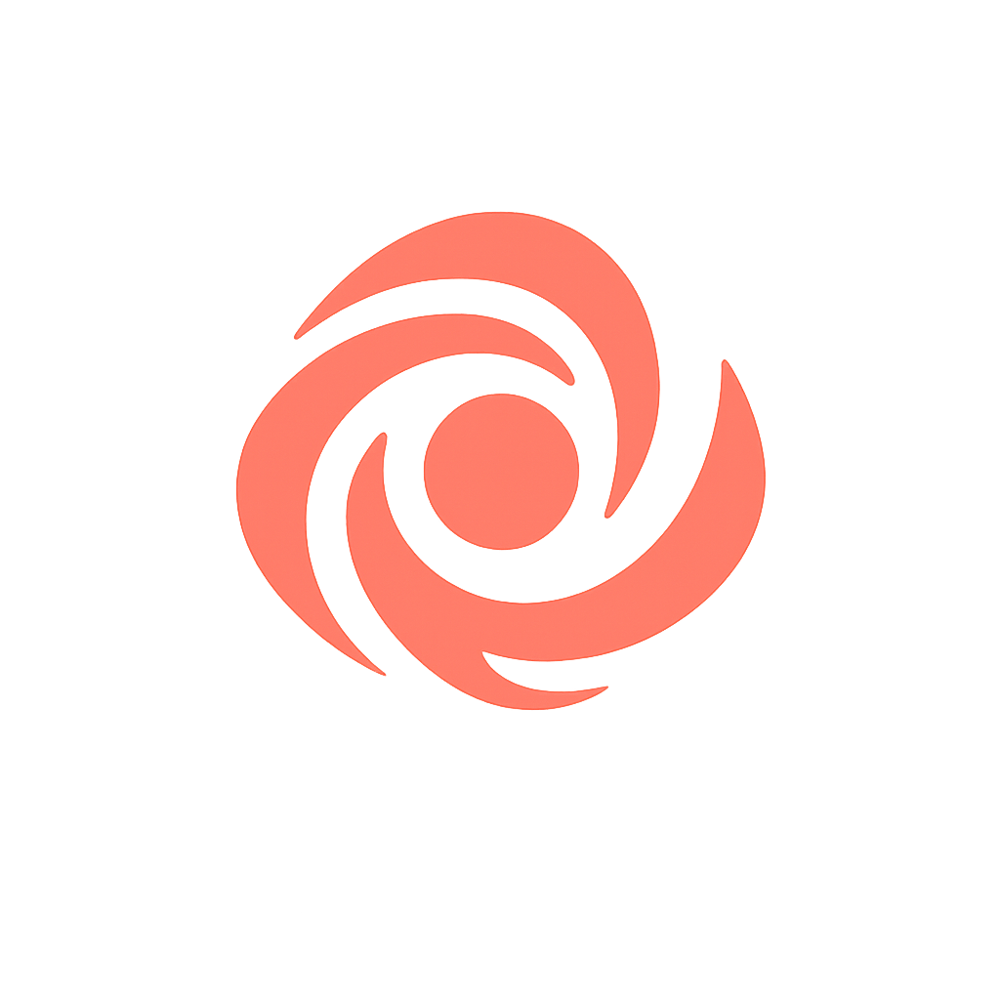

# IRIS

<div align="center">
  
  <h1>IRIS - Intelligent Response & Information System</h1>
  <p>A powerful AI assistant with multi-modal capabilities</p>
  
  [](https://github.com/amardeeplakshkar/iris/blob/main/LICENSE)
  [](https://nextjs.org/)
  [](https://www.typescriptlang.org/)
</div>

## 🌟 Features

IRIS is a versatile AI assistant application that combines multiple capabilities:

- **💬 Advanced Chat Interface**: Engage in natural conversations with AI
- **🖼️ Image Generation**: Create images from text descriptions using DALL-E models
- **🌤️ Weather Information**: Get real-time weather data for any location
- **📊 Diagram Creation**: Generate and visualize diagrams using Mermaid syntax
- **📝 YouTube Transcription**: Extract and analyze transcripts from YouTube videos
- **📱 Responsive Design**: Works seamlessly across desktop and mobile devices
- **🌓 Dark/Light Mode**: Choose your preferred theme for comfortable viewing

## 🚀 Getting Started

### Prerequisites

- Node.js 18.x or higher
- npm, yarn, or pnpm

### Installation

1. Clone the repository:
   ```bash
   git clone https://github.com/amardeeplakshkar/iris.git
   cd iris
   ```

2. Install dependencies:
   ```bash
   npm install
   # or
   yarn install
   # or
   pnpm install
   ```

3. Create a `.env` file in the root directory with the following variables:
   ```
   OPENAI_API_KEY=your_openai_api_key
   IMAGE_BASE_URL=https://api.openai.com/v1/images/generations
   ```

4. Start the development server:
   ```bash
   npm run dev
   # or
   yarn dev
   # or
   pnpm dev
   ```

5. Open [http://localhost:3000](http://localhost:3000) in your browser to see the application.

## 🛠️ Tech Stack

IRIS is built with modern technologies:

- **Frontend**: Next.js 14, React, TypeScript
- **Styling**: Tailwind CSS
- **AI Integration**: AI SDK, OpenAI API
- **Diagram Rendering**: Mermaid.js
- **UI Components**: Custom components with shadcn/ui
- **API Routes**: Next.js API routes for backend functionality

## 📖 Usage

### Chat Interface

The main interface allows you to chat with the AI assistant. Simply type your message in the input box at the bottom of the screen and press Enter or click the send button.

### Image Generation

To generate images, you can ask IRIS to create an image based on your description. For example:

```
Generate an image of a futuristic city with flying cars
```

### Weather Information

Get current weather information by asking about a specific location:

```
What's the weather like in New York?
```

### Diagram Creation

Create diagrams using Mermaid syntax:

```
Create a flowchart diagram for a user authentication process
```

### YouTube Transcription

Extract and analyze the content of YouTube videos:

```
Transcribe this YouTube video: https://www.youtube.com/watch?v=example
```

## 🧩 Project Structure

```
iris/
├── app/                  # Next.js app directory
│   ├── api/              # API routes
│   ├── page.tsx          # Main page component
├── components/           # React components
│   ├── core/             # Core application components
│   ├── ui/               # UI components
│   ├── widgets/          # Feature-specific widgets
├── lib/                  # Utility functions and tools
│   ├── ai/               # AI-related functionality
│   ├── tools/            # Tool implementations
│   ├── ui/               # UI utilities
├── public/               # Static assets
```

## 🤝 Contributing

Contributions are welcome! Please feel free to submit a Pull Request.

1. Fork the repository
2. Create your feature branch (`git checkout -b feature/amazing-feature`)
3. Commit your changes (`git commit -m 'Add some amazing feature'`)
4. Push to the branch (`git push origin feature/amazing-feature`)
5. Open a Pull Request

## 📄 License

This project is licensed under the MIT License - see the LICENSE file for details.

## 🙏 Acknowledgements

- [Next.js](https://nextjs.org/) - The React Framework
- [OpenAI](https://openai.com/) - For AI models
- [Mermaid.js](https://mermaid-js.github.io/mermaid/) - For diagram rendering
- [shadcn/ui](https://ui.shadcn.com/) - For UI components

## 🌟 Special Thanks

- [Pollinations](https://github.com/pollinations) - For providing AI API services

---

<div align="center">
  <p>Created with ❤️ by <a href="https://github.com/amardeeplakshkar">Amardeep Lakshkar</a></p>
</div>
